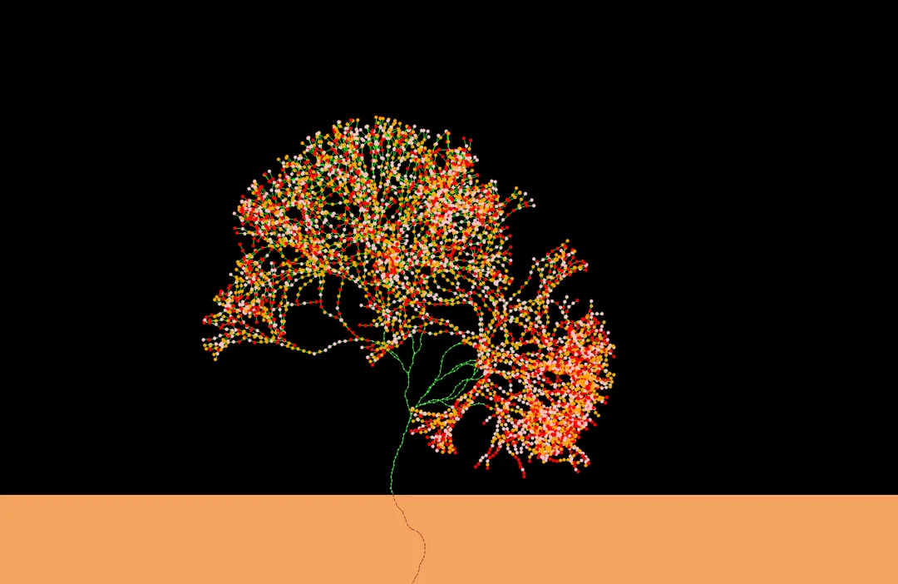

# Plant Growth Simulation

This project is a simulation of plant growth dynamics that models both above-ground branches and leaves and below-ground root development. It incorporates environmental factors such as sunlight, temperature, and soil moisture to drive growth patterns, branching behavior, and flowering.

## Features

- Environmental scalar fields influencing growth: sunlight, temperature, and moisture.
- Branching and bifurcation dynamics for shoots.
- Root growth adapting to soil moisture.
- Flower blooming triggered in late growth cycles.
- Interactive 2D visualization leveraging PyQtGraph for real-time viewing of plant structure.
- High-performance computation with Numba JIT acceleration.

## Project Structure

- `main.py`: Main simulation and visualization code defining the `Plant` class and running the growth cycles.
- `plantsim_config.py`: Configuration file with simulation parameters such as domain size, growth rates, and flowering thresholds.

## Requirements

- Python 3.7 or higher
- Packages:
  - numpy
  - numba
  - pyqtgraph
  - PyQt6 or PySide6 (for Qt bindings)

  You can install the required packages with:

  ```bash
  pip install numpy numba pyqtgraph PyQt6
  ```

## Running the Simulation

Run the `main.py` script to execute the simulation and open an interactive window showing the plant growth over a series of discrete time cycles:

```bash
python main.py
```

The window displays:

- Green lines for branches.
- Brown dashed lines for roots.
- Light green scatter points for leaves.
- Colored scatter points for flowers blooming after a threshold cycle.

## Visualization Examples

Below are example images showing the plant growth simulation output for different growth scenarios (only the config parameters are changed):




## Configuration

Modify parameters in `plantsim_config.py` to customize the simulation, including:

- Domain dimensions (`WIDTH`, `HEIGHT`, `SOIL_DEPTH`)
- Growth rates for branches and roots
- Branch angle variation and branching probability
- Timing and appearance parameters for flowers

## Development Notes

- The computationally intensive parts use Numba's `njit` and parallelization.
- Visualization uses PyQtGraph for efficient graphics rendering.
- Logging outputs cycle progress and statistics in the console.

## License

This project is open source and free to use under the MIT License.

## Author

Shreyak Chakraborty

## Acknowledgments

Inspired by plant growth models and environmental factor-driven simulations.
